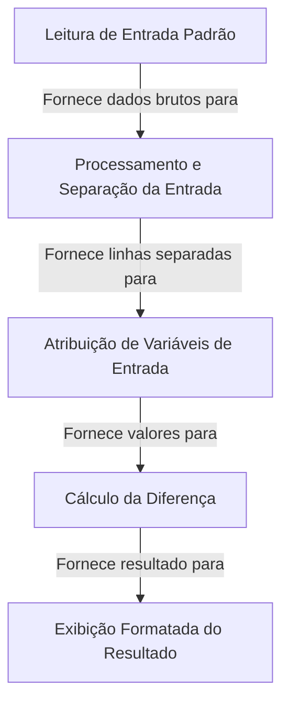

# Tutorial: test

Este projeto é um programa simples que **lê quatro números** inteiros da entrada padrão.
Ele *processa* esses números, separando-os e atribuindo-os a variáveis distintas.
Em seguida, calcula a **diferença** entre o produto dos dois primeiros números e o produto dos dois últimos.
Finalmente, *exibe* o resultado formatado com a mensagem "DIFERENCA = ".

**Source Repository:** [None](None)

## Chapters

1. [Leitura de Entrada Padrão
](01_leitura_de_entrada_padrão_.md)
2. [Processamento e Separação da Entrada
](02_processamento_e_separação_da_entrada_.md)
3. [Atribuição de Variáveis de Entrada
](03_atribuição_de_variáveis_de_entrada_.md)
4. [Cálculo da Diferença
](04_cálculo_da_diferença_.md)
5. [Exibição Formatada do Resultado
](05_exibição_formatada_do_resultado_.md)

---

Generated by [AI Codebase Knowledge Builder](https://github.com/The-Pocket/Tutorial-Codebase-Knowledge)