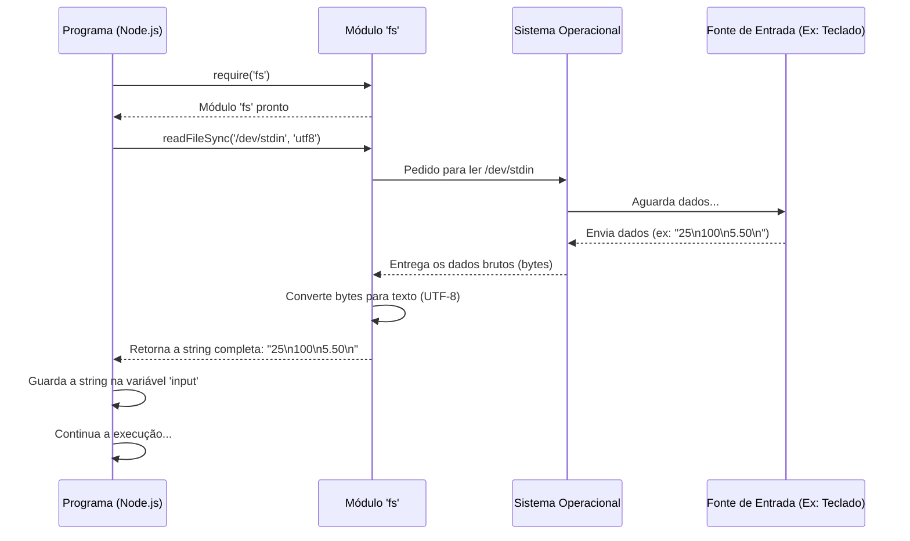

# Chapter 1: Leitura de Entrada Padrão


Olá! Bem-vindo(a) ao nosso tutorial. Neste primeiro capítulo, vamos descobrir como um programa de computador consegue "ouvir" ou "ler" as informações que nós, usuários, digitamos ou que vêm de outra fonte externa. É como ensinar o programa a receber instruções pela porta da frente!

**O Problema: Como o Programa Obtém Dados?**

Imagine que você está construindo uma calculadora muito simples. Para somar dois números, a calculadora precisa primeiro saber *quais* são esses números, certo? Como ela pega esses números que você digita no teclado? É exatamente isso que vamos aprender: como fazer o programa ler os dados que chegam até ele.

No nosso caso, vamos ver como ler *todas* as informações que são enviadas para o programa de uma só vez, como se ele recebesse um envelope fechado contendo várias linhas de texto.

**A Porta de Entrada: `/dev/stdin`**

Pense no seu programa como uma casa. Para que informações entrem na casa, elas precisam passar pela porta principal. Em muitos sistemas operacionais (como Linux e macOS), existe uma "porta" especial para entrada de dados chamada `/dev/stdin`. Ela representa a **entrada padrão** – o canal principal por onde um programa recebe informações, geralmente do teclado ou de outro programa.

**A Ferramenta: O Módulo `fs`**

Para interagir com arquivos e, neste caso, com a nossa "porta" de entrada padrão (`/dev/stdin`), usamos uma ferramenta que já vem com o Node.js (o ambiente onde nosso código JavaScript vai rodar). Essa ferramenta é o módulo `fs`, que significa *file system* (sistema de arquivos).

Pense no `fs` como uma caixa de ferramentas cheia de funções úteis para lidar com arquivos.

**Lendo a Entrada com `readFileSync`**

Dentro da caixa de ferramentas `fs`, existe uma função específica chamada `readFileSync`. O nome já dá uma pista:
*   `read`: Ler
*   `File`: Arquivo
*   `Sync`: Síncrono (vamos entender isso melhor)

`readFileSync` lê o conteúdo *completo* de um arquivo de uma vez só. "Síncrono" significa que o programa vai parar e esperar até que toda a leitura seja concluída antes de continuar para a próxima linha de código. É como pedir para um recepcionista buscar um documento e esperar ele voltar com o documento na mão antes de fazer qualquer outra coisa.

**Juntando Tudo: Lendo a Entrada Padrão**

Agora, vamos usar nossa ferramenta (`fs.readFileSync`) para ler da nossa porta de entrada (`/dev/stdin`). Veja a linha de código que faz isso no nosso projeto `1007.js`:

```javascript
// Importa a caixa de ferramentas 'fs'
var fs = require('fs'); 

// Lê todo o conteúdo da entrada padrão (/dev/stdin)
// e interpreta como texto (utf8)
var input = fs.readFileSync('/dev/stdin', 'utf8'); 
```

Vamos analisar essa linha:

1.  `require('fs')`: Isso "pega" a caixa de ferramentas `fs` e a torna disponível para uso no nosso código.
2.  `fs.readFileSync('/dev/stdin', 'utf8')`: Aqui chamamos a função `readFileSync` do módulo `fs`.
    *   `/dev/stdin`: Dizemos a ela para ler da nossa porta de entrada padrão.
    *   `'utf8'`: Especificamos a "codificação". Pense nisso como o idioma em que a informação está escrita. `utf8` é um padrão muito comum que permite ler textos com letras, números, acentos e muitos outros símbolos. Sem isso, o computador poderia não entender o que leu.
3.  `var input = ...`: Todo o texto lido da entrada padrão é guardado em uma "caixa" (variável) chamada `input`.

**Exemplo Prático**

Imagine que você execute o programa e digite (ou forneça) o seguinte:

```
25
100
5.50
```

Após a linha `var input = fs.readFileSync('/dev/stdin', 'utf8');` ser executada, a variável `input` conterá *todo* esse texto como uma única string (um pedaço de texto):

```
"25\n100\n5.50\n" 
```

Note o `\n`. Isso representa a "quebra de linha" – o ato de pressionar Enter no teclado. A leitura pegou tudo, incluindo essas quebras de linha.

**Como Funciona por Baixo dos Panos?**

Vamos espiar o que acontece quando essa linha de código é executada:

1.  **Pedido:** Seu programa (rodando em Node.js) chega na linha `readFileSync`.
2.  **Chamada ao Sistema:** O Node.js, através do módulo `fs`, pede ao Sistema Operacional (SO): "Por favor, leia o conteúdo do arquivo especial `/dev/stdin`".
3.  **Espera:** O SO fica aguardando. Se a entrada vier do teclado, ele espera você digitar e pressionar Enter (e geralmente um comando para indicar o fim da entrada, como Ctrl+D). Se a entrada vier de outro programa, ele espera esse outro programa enviar os dados.
4.  **Entrega:** Assim que a entrada é finalizada, o SO entrega todos os dados lidos (como uma sequência de bytes) para o Node.js.
5.  **Decodificação:** O Node.js (com a ajuda da informação `'utf8'`) converte esses bytes em um texto legível (uma string).
6.  **Armazenamento:** Essa string de texto completa é finalmente armazenada na variável `input`.
7.  **Continuação:** Só agora o programa continua a executar a próxima linha de código.

Podemos visualizar isso com um diagrama:



**Por Que Ler Tudo de Uma Vez?**

Em muitos desafios de programação competitiva (como os do Beecrowd, de onde o exemplo `1007.js` vem), a entrada é fornecida toda de uma vez antes do programa começar a processar. Ler tudo de uma vez com `readFileSync` é uma maneira simples e eficaz de obter todos os dados necessários logo no início.

**E Agora?**

Ótimo! Agora nosso programa sabe como receber um "envelope" cheio de informações (a variável `input`). Mas geralmente, não queremos trabalhar com o envelope inteiro de uma vez. Queremos abrir o envelope e pegar cada informação separadamente (cada número em uma linha, por exemplo).

Como fazemos para separar essa string grandona em pedaços menores e mais úteis? É exatamente isso que veremos no próximo capítulo!

**Conclusão**

Neste capítulo, aprendemos o primeiro passo fundamental: como um programa Node.js pode ler dados da entrada padrão. Vimos:

*   A entrada padrão (`/dev/stdin`) como a porta principal para receber dados.
*   O módulo `fs` como nossa caixa de ferramentas para interagir com arquivos e entradas.
*   A função `fs.readFileSync('/dev/stdin', 'utf8')` como a maneira de ler *todo* o conteúdo da entrada padrão de uma só vez e armazená-lo como texto em uma variável.

Agora que temos os dados brutos, estamos prontos para o próximo passo: organizar e preparar esses dados para uso.

Vamos seguir em frente para aprender como processar essa entrada!

**Próximo Capítulo:** [Processamento e Separação da Entrada](02_processamento_e_separação_da_entrada_.md)

---

Generated by [AI Codebase Knowledge Builder](https://github.com/The-Pocket/Tutorial-Codebase-Knowledge)