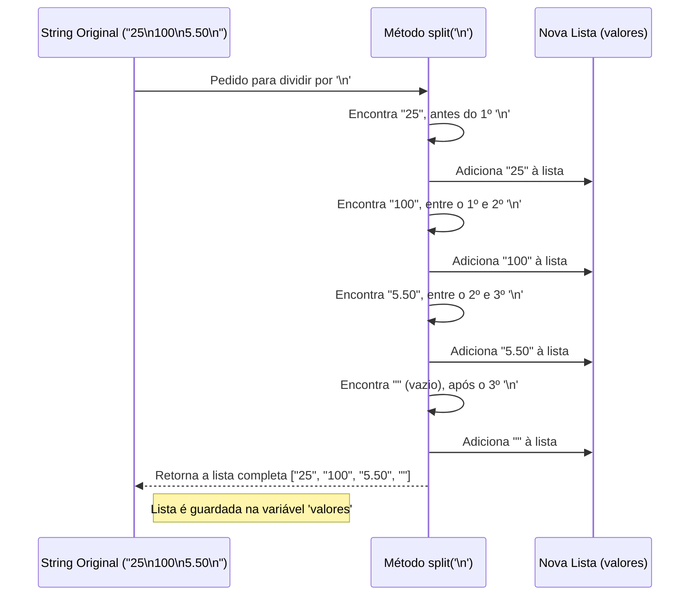

# Chapter 2: Processamento e Separação da Entrada


Olá novamente! No [Capítulo 1: Leitura de Entrada Padrão](01_leitura_de_entrada_padrão_.md), aprendemos como nosso programa consegue ler todas as informações enviadas a ele de uma só vez, guardando tudo em uma única variável chamada `input`. Essa variável ficou como um grande bloco de texto, incluindo as quebras de linha (`\n`) que separam cada informação.

Mas, geralmente, não queremos trabalhar com o texto todo de uma vez. Se estamos construindo nossa calculadora, e o usuário digitou dois números, um em cada linha, precisamos pegar cada número separadamente para poder somá-los. Como fazemos isso?

**O Problema: Como Separar as Informações?**

Imagine que o recepcionista do capítulo anterior recebeu aquele envelope com várias instruções, uma em cada linha. Ele tem o papel na mão, mas para entregar cada instrução à pessoa certa, ele precisa primeiro *separar* essas instruções. Ele não pode entregar o papel inteiro para todo mundo!

No nosso caso, a variável `input` contém algo como:

```
"25\n100\n5.50\n"
```

Esse `\n` é o caractere especial que representa a "quebra de linha", o momento em que apertamos Enter. Queremos transformar essa única string (texto) em uma lista onde cada item é uma dessas linhas originais. Queremos algo assim: `["25", "100", "5.50"]`.

**A Ferramenta: O Método `split()`**

Felizmente, o JavaScript (a linguagem que estamos usando) nos dá uma ferramenta perfeita para isso: o método `split()`. Pense no `split()` como uma tesoura mágica para strings. Você diz a ela qual caractere usar como ponto de corte, e ela divide a string nesses pontos, entregando os pedaços em uma lista organizada.

**Como Usar o `split()`**

No nosso projeto (`1007.js`), usamos o `split()` logo após ler a entrada:

```javascript
// Lemos toda a entrada no Capítulo 1
var input = require('fs').readFileSync('/dev/stdin', 'utf8');

// Agora, separamos a entrada em linhas
// Usamos a quebra de linha '\n' como separador
var valores = input.split('\n'); 
```

Vamos analisar a nova linha:

1.  `input`: É a nossa variável que contém a string completa lida no capítulo anterior (ex: `"25\n100\n5.50\n"`).
2.  `.split()`: Chamamos o método `split` *diretamente* na nossa string `input`. É como dizer: "String `input`, separe-se!".
3.  `('\n')`: Dentro dos parênteses, passamos o "separador". Aqui, dizemos para cortar a string toda vez que encontrar o caractere de quebra de linha (`\n`).
4.  `var valores = ...`: O resultado da operação `split()` não é uma string, mas sim uma **lista** (em JavaScript, chamamos isso de *Array*) contendo as partes separadas. Guardamos essa lista na nova variável chamada `valores`.

**Exemplo Prático**

Vamos ver o que acontece com nosso exemplo:

*   **Entrada (variável `input`):** `"25\n100\n5.50\n"`
*   **Código:** `var valores = input.split('\n');`
*   **Saída (variável `valores`):** `["25", "100", "5.50", ""]`

O resultado é uma lista de strings! Cada número que estava em uma linha separada agora é um item individual dentro da lista `valores`.

**Atenção ao Detalhe:** Percebeu que o último item na lista é uma string vazia (`""`)? Isso acontece porque nossa string original `input` terminava com um `\n`. O `split('\n')` encontra esse último `\n` e cria um item na lista para o que vem *depois* dele. Como não há nada depois do último `\n`, o resultado é uma string vazia. Isso é comum e vamos aprender a lidar com isso no próximo capítulo.

**Como Funciona por Baixo dos Panos?**

Quando você chama `input.split('\n')`, o motor do JavaScript faz algo parecido com isto:

1.  **Início:** Ele olha para a string original: `"25\n100\n5.50\n"`.
2.  **Procura:** Ele começa a ler a string do início, procurando pelo separador `\n`.
3.  **Encontra o 1º `\n`:** Opa! Achou um `\n` depois do `"25"`.
4.  **Corta e Guarda:** Ele pega o texto que veio *antes* do `\n` (que é `"25"`) e adiciona como o primeiro item de uma nova lista. A lista agora é `["25"]`.
5.  **Continua:** Ele continua a procurar *depois* do `\n` que acabou de processar.
6.  **Encontra o 2º `\n`:** Achou outro `\n` depois do `"100"`.
7.  **Corta e Guarda:** Pega o texto entre o `\n` anterior e este (`"100"`) e adiciona à lista. A lista agora é `["25", "100"]`.
8.  **Encontra o 3º `\n`:** Achou mais um `\n` depois do `"5.50"`.
9.  **Corta e Guarda:** Pega o texto `"5.50"` e adiciona à lista. A lista agora é `["25", "100", "5.50"]`.
10. **Fim da String?** Ele continua procurando depois do último `\n`. A string acaba aqui.
11. **Último Corte:** Como a string terminava com `\n`, ele considera que há um último "pedaço" depois dele, mesmo que vazio. Ele adiciona uma string vazia (`""`) à lista. A lista final é `["25", "100", "5.50", ""]`.
12. **Retorna:** O método `split` entrega essa lista completa, que é então armazenada na variável `valores`.

Podemos visualizar isso:



**O Código em Contexto**

No nosso arquivo `1007.js`, essas duas primeiras linhas trabalham juntas:

```javascript
// --- File: 1007.js ---

// 1. Lê toda a entrada como uma única string (Capítulo 1)
var input = require('fs').readFileSync('/dev/stdin', 'utf8'); 

// 2. Separa a string em uma lista de strings, usando '\n' como divisor (Este Capítulo)
var valores = input.split('\n'); 

// ... (o resto do código que usará a lista 'valores')
```

Primeiro, pegamos o "envelope fechado" (`input`). Depois, usamos a "tesoura" (`split`) para cortar o conteúdo em "tiras" individuais (a lista `valores`).

**E Agora?**

Excelente! Conseguimos transformar aquele bloco de texto único em uma lista organizada, onde cada item corresponde a uma linha da entrada original. Agora temos `["25", "100", "5.50", ""]`.

O próximo passo é pegar cada um desses itens da lista e colocá-los em suas próprias variáveis, para podermos usá-los individualmente nos nossos cálculos. Por exemplo, como pegamos o `"25"` e colocamos numa variável `A`, o `"100"` numa variável `B`, e assim por diante?

É exatamente isso que veremos no próximo capítulo!

**Conclusão**

Neste capítulo, demos um passo crucial no processamento dos dados de entrada:

*   Entendemos a necessidade de separar um bloco de texto multi-linhas em partes individuais.
*   Aprendemos sobre o método `split('\n')`, a ferramenta que nos permite fazer essa separação usando a quebra de linha como divisor.
*   Vimos como o resultado do `split()` é uma *lista* (Array) de strings.
*   Analisamos um exemplo prático e entendemos como o `split()` funciona internamente.

Agora que temos nossos dados brutos organizados em uma lista, estamos prontos para distribuí-los em variáveis específicas.

**Próximo Capítulo:** [Atribuição de Variáveis de Entrada](03_atribuição_de_variáveis_de_entrada_.md)

---

Generated by [AI Codebase Knowledge Builder](https://github.com/The-Pocket/Tutorial-Codebase-Knowledge)