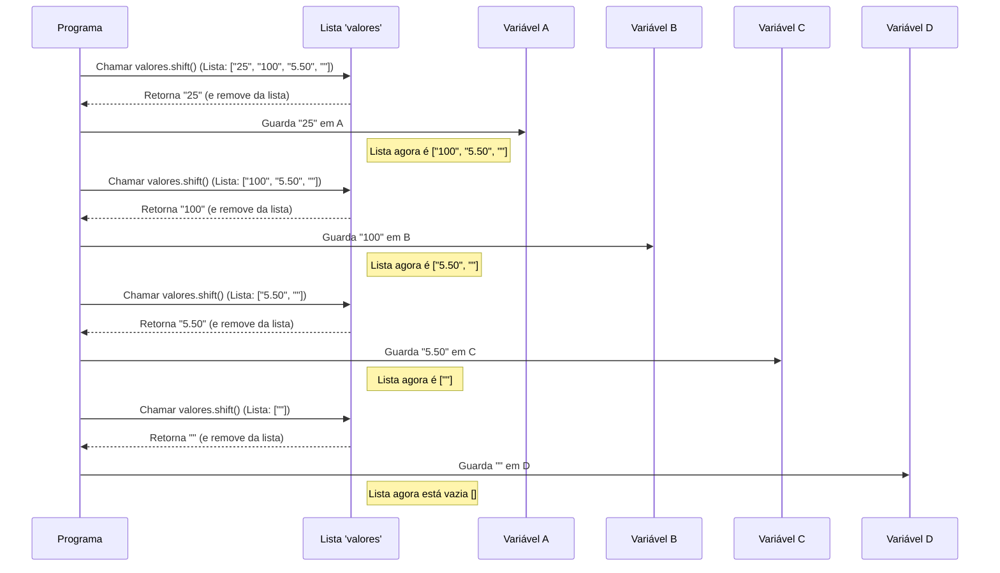

# Chapter 3: Atribuição de Variáveis de Entrada


Olá! No capítulo anterior, [Processamento e Separação da Entrada](02_processamento_e_separação_da_entrada_.md), conseguimos transformar o bloco de texto que lemos da entrada em uma lista organizada de strings. Se a entrada foi:

```
25
100
5.50
```

Nossa variável `valores` ficou assim: `["25", "100", "5.50", ""]`.

Ótimo, agora temos os dados separados! Mas como usamos cada um desses valores individualmente? Para o nosso problema (que vamos detalhar mais no próximo capítulo), precisamos que o primeiro valor (`"25"`) seja A, o segundo (`"100"`) seja B, o terceiro (`"5.50"`) seja C, e o quarto (a string vazia `""` no nosso exemplo, mas que poderia ser outro número em outros casos) seja D. Precisamos "distribuir" esses itens da lista para locais nomeados.

**O Problema: Como Pegar Cada Item da Lista e Dar um Nome a Ele?**

Imagine que você tem uma pilha de tarefas escritas em papéis separados (nossa lista `valores`). Para realizar o trabalho, você precisa pegar a primeira tarefa da pilha, colocá-la em uma caixa etiquetada "Tarefa A", pegar a segunda, colocar na caixa "Tarefa B", e assim por diante. Como fazemos isso no código?

Precisamos de uma maneira de:
1.  Pegar o *primeiro* item da lista `valores`.
2.  Guardar esse item em uma variável com um nome específico (como `A`).
3.  Repetir o processo para o próximo item e a próxima variável (`B`), e assim por diante.

**As Ferramentas: Variáveis e o Método `shift()`**

1.  **Variáveis:** Como vimos antes, variáveis (`var A`, `var B`, etc.) são como caixas etiquetadas onde podemos guardar informações (números, texto, listas...). Elas nos permitem dar um nome a um valor para poder usá-lo mais tarde.

2.  **O Método `shift()`:** O JavaScript oferece um método muito útil para listas (arrays) chamado `shift()`. Pense na lista `valores` como uma fila de pessoas esperando para serem atendidas. O `shift()` faz duas coisas importantes:
    *   Ele "chama" a **primeira pessoa da fila** (o primeiro item da lista).
    *   Ele **remove** essa pessoa da fila (o item é retirado permanentemente da lista original).
    *   Ele te entrega a informação sobre quem era essa primeira pessoa (o valor do primeiro item).

É como pegar o primeiro papel do topo de uma pilha: você pega o papel (obtém o valor) e ele não está mais na pilha (é removido da lista).

**Aplicando `shift()` para Atribuir Variáveis**

No nosso arquivo `1007.js`, usamos o `shift()` repetidamente para pegar cada valor da lista `valores` e atribuí-lo às variáveis A, B, C e D:

```javascript
// --- Continuação do arquivo 1007.js ---

// No capítulo anterior, tínhamos:
// var input = require('fs').readFileSync('/dev/stdin', 'utf8');
// var valores = input.split('\n'); // Exemplo: ["25", "100", "5.50", ""]

// Agora, distribuímos os valores:

// 1. Pega o PRIMEIRO item de 'valores', guarda em A, e remove de 'valores'
var A = valores.shift(); 

// 2. Pega o NOVO PRIMEIRO item de 'valores', guarda em B, e remove de 'valores'
var B = valores.shift(); 

// 3. Pega o NOVO PRIMEIRO item de 'valores', guarda em C, e remove de 'valores'
var C = valores.shift(); 

// 4. Pega o NOVO PRIMEIRO item de 'valores', guarda em D, e remove de 'valores'
var D = valores.shift(); 
```

**Exemplo Passo a Passo:**

Vamos acompanhar o que acontece com a nossa lista `valores = ["25", "100", "5.50", ""]`:

1.  **`var A = valores.shift();`**
    *   `shift()` olha para `valores`: `["25", "100", "5.50", ""]`.
    *   Pega o primeiro item: `"25"`.
    *   Remove `"25"` da lista.
    *   Retorna `"25"`, que é guardado na variável `A`.
    *   **Resultado:** `A` agora contém `"25"`, e `valores` agora é `["100", "5.50", ""]`.

2.  **`var B = valores.shift();`**
    *   `shift()` olha para `valores`: `["100", "5.50", ""]`.
    *   Pega o primeiro item: `"100"`.
    *   Remove `"100"` da lista.
    *   Retorna `"100"`, que é guardado na variável `B`.
    *   **Resultado:** `B` agora contém `"100"`, e `valores` agora é `["5.50", ""]`.

3.  **`var C = valores.shift();`**
    *   `shift()` olha para `valores`: `["5.50", ""]`.
    *   Pega o primeiro item: `"5.50"`.
    *   Remove `"5.50"` da lista.
    *   Retorna `"5.50"`, que é guardado na variável `C`.
    *   **Resultado:** `C` agora contém `"5.50"`, e `valores` agora é `[""]`.

4.  **`var D = valores.shift();`**
    *   `shift()` olha para `valores`: `[""]`.
    *   Pega o primeiro item: `""` (a string vazia).
    *   Remove `""` da lista.
    *   Retorna `""`, que é guardado na variável `D`.
    *   **Resultado:** `D` agora contém `""`, e `valores` agora é `[]` (uma lista vazia).

Pronto! Conseguimos pegar cada valor da entrada original, que estava organizado na lista `valores`, e colocar cada um em sua própria "caixa" etiquetada: `A`, `B`, `C` e `D`.

**Como Funciona por Baixo dos Panos?**

Quando chamamos `valores.shift()`, o motor JavaScript realiza os seguintes passos:

1.  **Verifica:** O motor olha para a lista `valores` e verifica se ela não está vazia.
2.  **Identifica:** Ele identifica o elemento que está na primeira posição (índice 0).
3.  **Guarda Temporariamente:** Ele copia o valor desse primeiro elemento para um local temporário.
4.  **Remove:** Ele remove o primeiro elemento da lista.
5.  **Reorganiza (Opcional):** Internamente, a lista pode precisar ser reorganizada. Imagine que todos os outros elementos precisam "dar um passo à frente" para ocupar o espaço vazio.
6.  **Retorna:** O motor entrega o valor que foi guardado temporariamente (o valor do elemento que estava na primeira posição).

Podemos visualizar o processo com um diagrama:



**O Código Completo Até Agora**

Vamos ver como as peças se encaixam no nosso arquivo `1007.js`:

```javascript
// --- File: 1007.js ---

// Capítulo 1: Ler toda a entrada
var input = require('fs').readFileSync('/dev/stdin', 'utf8'); 

// Capítulo 2: Separar a entrada em uma lista de linhas
var valores = input.split('\n'); 

// Capítulo 3: Atribuir cada linha a uma variável específica
var A = valores.shift(); // Pega o primeiro valor
var B = valores.shift(); // Pega o segundo valor
var C = valores.shift(); // Pega o terceiro valor
var D = valores.shift(); // Pega o quarto valor (pode ser vazio se a entrada tiver só 3 linhas úteis)

// ... (o código continua para usar A, B, C, D)
```

**Uma Observação Importante: Tipos de Dados**

É crucial notar que os valores que guardamos em `A`, `B`, `C` e `D` são **strings** (texto), mesmo que pareçam números (`"25"`, `"100"`, `"5.50"`). Isso porque o `split()` gera strings, e o `shift()` apenas pega essas strings da lista.

Se quisermos fazer cálculos matemáticos com eles (como A * B - C * D), precisaremos primeiro converter essas strings em números de verdade. Como fazer isso? Veremos no próximo capítulo!

**E Agora?**

Fantástico! Agora temos variáveis individuais (`A`, `B`, `C`, `D`) que contêm os dados de entrada que precisamos, prontos para serem usados. Distribuímos as "tarefas" para as "caixas" corretas.

O próximo passo lógico é usar essas variáveis para fazer o cálculo que o problema pede.

**Conclusão**

Neste capítulo, aprendemos como pegar os itens processados e separados de uma lista e atribuí-los a variáveis individuais:

*   Entendemos a necessidade de nomear cada pedaço de informação da entrada.
*   Conhecemos o método `shift()`, que remove e retorna o primeiro item de uma lista.
*   Vimos como usar `shift()` repetidamente para pegar cada valor sequencialmente e armazená-lo em variáveis como `A`, `B`, `C` e `D`.
*   Observamos que os valores armazenados ainda são strings e precisarão ser convertidos para cálculos.

Com nossas variáveis prontas, estamos preparados para realizar a lógica principal do nosso programa.

**Próximo Capítulo:** [Cálculo da Diferença](04_cálculo_da_diferença_.md)

---

Generated by [AI Codebase Knowledge Builder](https://github.com/The-Pocket/Tutorial-Codebase-Knowledge)