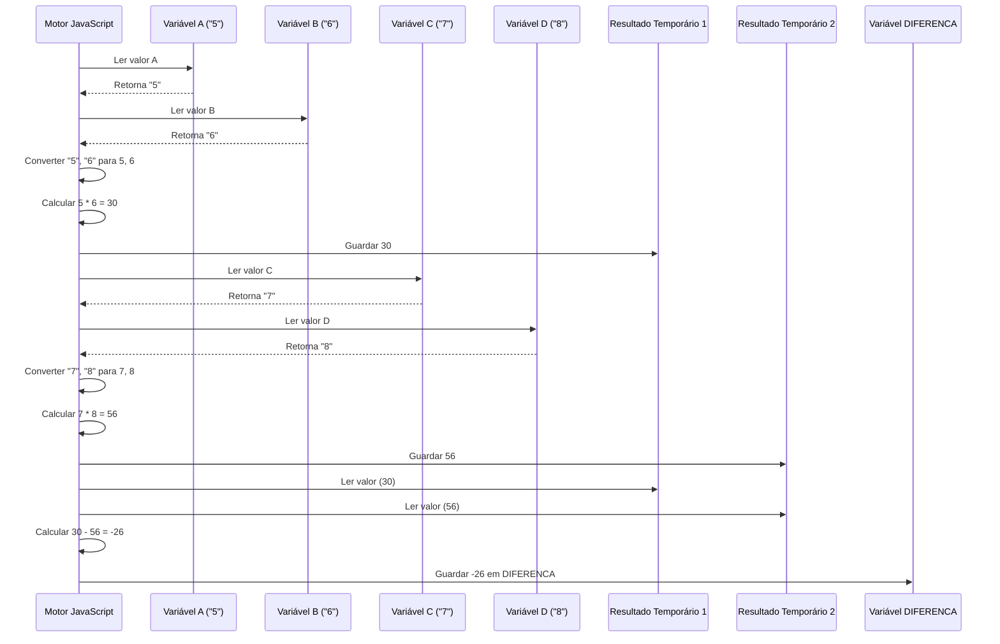

# Chapter 4: Cálculo da Diferença


Olá! No [Capítulo 3: Atribuição de Variáveis de Entrada](03_atribuição_de_variáveis_de_entrada_.md), conseguimos pegar cada linha da nossa entrada, que estava numa lista, e guardá-la em variáveis separadas: `A`, `B`, `C` e `D`. Usando o exemplo de entrada com números inteiros (conforme o problema 1007 original sugere):

Entrada:
```
5
6
7
8
```

Após o Capítulo 3, teríamos:
*   `A` conteria a string `"5"`
*   `B` conteria a string `"6"`
*   `C` conteria a string `"7"`
*   `D` conteria a string `"8"`

Agora que temos nossos "ingredientes" separados em suas respectivas "caixas", estamos prontos para seguir a "receita"!

**O Problema: Como Realizar a Operação Matemática?**

O coração do nosso programa é executar uma tarefa matemática específica. A descrição do conceito nos diz qual é a fórmula: multiplicar `A` por `B`, multiplicar `C` por `D`, e então subtrair o segundo resultado do primeiro. Em outras palavras, queremos calcular:

`(A * B) - (C * D)`

Este cálculo é o objetivo principal, a "diferença" que precisamos encontrar. Como traduzimos essa fórmula matemática para o código JavaScript?

**A Receita e os Ingredientes (Variáveis)**

Já temos os ingredientes: as variáveis `A`, `B`, `C` e `D`. A receita é a fórmula `(A * B) - (C * D)`. O JavaScript nos permite escrever essa fórmula de forma muito parecida com a matemática tradicional.

**Uma Pedra no Caminho: Texto vs. Números**

Aqui temos um detalhe muito importante! Lembra que no capítulo anterior mencionamos que `A`, `B`, `C` e `D` guardam **strings** (texto), como `"5"` e `"6"`, e não os números 5 e 6 diretamente?

Se tentarmos multiplicar texto, como `"maçã"` vezes `"banana"`, não faz sentido, certo? Computadores também não sabem multiplicar texto diretamente. Precisamos garantir que o computador entenda que `"5"` deve ser tratado como o número 5 antes de fazer a multiplicação.

**A Mágica (Implícita) do JavaScript: Conversão Automática**

Felizmente, em algumas situações, o JavaScript tenta nos ajudar. Quando usamos operadores matemáticos como `*` (multiplicação) e `-` (subtração) com strings que *parecem* números (como `"5"`, `"6"`), o JavaScript automaticamente (ou *implicitamente*) tenta converter essas strings em números antes de fazer a conta.

Isso é conveniente, mas também pode ser um pouco arriscado se a string não for um número válido. No nosso caso, como a entrada do problema 1007 garante que receberemos números, essa conversão implícita geralmente funciona.

**A Linha de Código Mágica**

Veja a linha no nosso arquivo `1007.js` que faz todo o trabalho:

```javascript
// --- Continuação do arquivo 1007.js ---
// Vimos antes como A, B, C, D foram preenchidos (como strings)

// Calcula a diferença seguindo a fórmula (A * B - C * D)
var DIFERENCA = (A * B - C * D); 
```

Vamos analisar essa linha em detalhes:

1.  `A * B`: O JavaScript pega a string em `A` (ex: `"5"`) e a string em `B` (ex: `"6"`). Como estamos usando o operador `*`, ele converte ambos para números (5 e 6) e multiplica o resultado (30).
2.  `C * D`: Faz o mesmo para `C` (ex: `"7"`) e `D` (ex: `"8"`). Converte para números (7 e 8) e multiplica (56).
3.  `(A * B) - (C * D)`: Agora temos os resultados das multiplicações (30 e 56). O operador `-` também funciona com números. Ele subtrai o segundo resultado do primeiro (30 - 56 = -26).
4.  `var DIFERENCA = ...`: O resultado final da subtração (-26) é armazenado em uma nova variável chamada `DIFERENCA`.

É como dar a receita e os ingredientes para o cozinheiro (o JavaScript), e ele segue os passos, até mesmo percebendo que precisa "descascar" os ingredientes (converter de string para número) antes de misturá-los.

**Nota sobre Boa Prática:** Embora a conversão implícita funcione aqui, em códigos mais complexos, é considerado uma prática mais segura e clara converter explicitamente as strings para números antes de usá-las em cálculos. Poderíamos fazer isso usando funções como `parseInt()` (para números inteiros) ou `parseFloat()` (para números com casas decimais). Por exemplo:

```javascript
// Alternativa mais explícita (não usada no código original 1007.js)
var numA = parseInt(A);
var numB = parseInt(B);
var numC = parseInt(C);
var numD = parseInt(D);
var DIFERENCA = (numA * numB - numC * numD); 
```
Isso torna o código mais fácil de entender e evita surpresas se `A`, `B`, `C` ou `D` contiverem algo inesperado. No entanto, para este tutorial, vamos nos ater ao código original que depende da conversão implícita do JavaScript.

**Como Funciona por Baixo dos Panos?**

Quando o JavaScript executa `var DIFERENCA = (A * B - C * D);`, ele segue aproximadamente estes passos:

1.  **Buscar A:** Encontra o valor da variável `A` (ex: `"5"`).
2.  **Buscar B:** Encontra o valor da variável `B` (ex: `"6"`).
3.  **Operação `*` (A, B):** Percebe que `*` é matemática. Vê que `A` e `B` são strings. Tenta convertê-las para números (5 e 6). Realiza 5 * 6 = 30. Guarda este resultado temporário.
4.  **Buscar C:** Encontra o valor da variável `C` (ex: `"7"`).
5.  **Buscar D:** Encontra o valor da variável `D` (ex: `"8"`).
6.  **Operação `*` (C, D):** Percebe que `*` é matemática. Vê que `C` e `D` são strings. Tenta convertê-las para números (7 e 8). Realiza 7 * 8 = 56. Guarda este resultado temporário.
7.  **Operação `-`:** Pega os dois resultados temporários (30 e 56). Percebe que `-` é matemática. Realiza 30 - 56 = -26.
8.  **Atribuição:** Pega o resultado final (-26) e armazena na variável `DIFERENCA`.

Podemos visualizar com um diagrama:



**O Código Completo Até Agora**

Vamos ver novamente o fluxo completo no `1007.js`:

```javascript
// --- File: 1007.js ---

// Capítulo 1: Ler toda a entrada
var input = require('fs').readFileSync('/dev/stdin', 'utf8'); 

// Capítulo 2: Separar a entrada em uma lista de linhas
var valores = input.split('\n'); 

// Capítulo 3: Atribuir cada linha (como string) a uma variável
var A = valores.shift(); // Ex: "5"
var B = valores.shift(); // Ex: "6"
var C = valores.shift(); // Ex: "7"
var D = valores.shift(); // Ex: "8"

// Capítulo 4: Calcular a diferença (com conversão implícita de string para número)
var DIFERENCA = (A * B - C * D); // Ex: (5 * 6 - 7 * 8) = 30 - 56 = -26

// ... (próximo passo: mostrar o resultado)
```

Conseguimos! Executamos a lógica principal do programa. Temos o resultado final do cálculo armazenado na variável `DIFERENCA`.

**E Agora?**

O programa fez a conta, e o resultado está guardado na memória, dentro da variável `DIFERENCA`. Mas... como nós, usuários, vemos esse resultado? O programa precisa comunicar a resposta de volta para nós.

O último passo é pegar o valor de `DIFERENCA` e exibi-lo na tela (ou na saída padrão) no formato específico que o problema pede. Como fazemos isso?

Isso é o que veremos no próximo e último capítulo!

**Conclusão**

Neste capítulo, mergulhamos no coração do nosso programa:

*   Entendemos a fórmula matemática que precisávamos calcular: `(A * B) - (C * D)`.
*   Relembramos que as variáveis `A`, `B`, `C`, `D` continham strings.
*   Aprendemos sobre a conversão implícita (automática) que o JavaScript faz de strings para números ao usar operadores como `*` e `-`.
*   Vimos a linha de código `var DIFERENCA = (A * B - C * D);` que realiza todo o cálculo.
*   Entendemos como o resultado final é armazenado na variável `DIFERENCA`.

Com o cálculo feito e o resultado em mãos, estamos prontos para a etapa final: mostrar a resposta ao mundo.

**Próximo Capítulo:** [Exibição Formatada do Resultado](05_exibição_formatada_do_resultado_.md)

---

Generated by [AI Codebase Knowledge Builder](https://github.com/The-Pocket/Tutorial-Codebase-Knowledge)