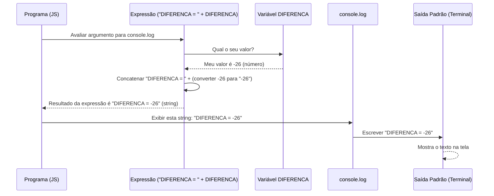

# Chapter 5: Exibição Formatada do Resultado


Olá novamente! No capítulo anterior, [Cálculo da Diferença](04_cálculo_da_diferença_.md), fizemos a parte principal do nosso trabalho: calculamos o resultado da expressão `(A * B - C * D)` e guardamos o valor final na variável `DIFERENCA`. Por exemplo, se a entrada foi 5, 6, 7 e 8, a variável `DIFERENCA` agora contém o número `-26`.

Ótimo, o computador já sabe a resposta! Mas... como nós, os usuários, ficamos sabendo? O programa precisa nos contar o resultado.

**O Problema: Como "Anunciar" a Resposta?**

Imagine que você calculou a pontuação final de um jogo, mas o resultado está apenas anotado em um papel escondido no seu bolso. Ninguém mais sabe! Para que o resultado seja útil, você precisa anunciá-lo. E mais, geralmente há uma forma específica de fazer isso. Em muitos problemas de programação, não basta apenas mostrar o número final; é preciso apresentá-lo com um texto junto, como "Resultado final: [número]" ou, no nosso caso específico, "DIFERENCA = [número]".

Como fazemos para que nosso programa JavaScript "fale" ou "escreva" essa resposta formatada na tela?

**A Ferramenta de Anúncio: `console.log()`**

A principal ferramenta que temos em JavaScript (especialmente quando rodando com Node.js) para mostrar informações na saída padrão (geralmente o terminal ou a tela onde você executa o programa) é o `console.log()`.

Pense no `console.log()` como o megafone do seu programa. Tudo o que você colocar dentro dos parênteses `()` será "anunciado" para o usuário ver.

**Formatando a Mensagem: Juntando Texto e Números**

Queremos exibir algo como `DIFERENCA = -26`. Isso é uma combinação de:
1.  Um texto fixo: `"DIFERENCA = "` (note o espaço no final!)
2.  O valor que está guardado na nossa variável `DIFERENCA` (que no nosso exemplo é o número `-26`).

Como juntamos essas duas partes em uma única mensagem para o `console.log()`? Usamos o operador `+`.

Quando você usa o `+` entre uma string (texto, como `"DIFERENCA = "`) e um número (como o valor em `DIFERENCA`), o JavaScript é inteligente o suficiente para:
1.  Converter o número em texto (transforma `-26` em `"-26"`).
2.  Juntar (concatenar) as duas strings.

Então, `"DIFERENCA = " + -26` resulta na string final `"DIFERENCA = -26"`.

**A Linha Final do Código**

Agora, veja a última linha do nosso arquivo `1007.js`:

```javascript
// --- Continuação e final do arquivo 1007.js ---
// Nos capítulos anteriores:
// var input = ... ; // Leu a entrada
// var valores = ... ; // Separou em linhas
// var A = ..., B = ..., C = ..., D = ...; // Atribuiu às variáveis (como strings)
// var DIFERENCA = (A * B - C * D); // Calculou o resultado (ex: -26)

// Agora, exibe o resultado formatado na saída padrão
console.log("DIFERENCA = " + DIFERENCA); 
```

Vamos analisar esta linha final:

1.  `console.log()`: Chamamos a função para exibir algo.
2.  `"DIFERENCA = "`: Fornecemos a parte de texto fixa que queremos mostrar primeiro. É importante incluir o espaço depois do `=` para que o número não fique colado.
3.  `+`: Usamos o operador de concatenação para juntar o texto com o valor seguinte.
4.  `DIFERENCA`: Colocamos o nome da variável que contém o resultado do nosso cálculo. O JavaScript pegará o valor atual dessa variável (ex: -26).

**Exemplo Completo:**

*   **Entrada fornecida ao programa:**
    ```
    5
    6
    7
    8
    ```
*   **Após o cálculo (Capítulo 4):** A variável `DIFERENCA` contém o valor numérico `-26`.
*   **Execução da linha `console.log("DIFERENCA = " + DIFERENCA);`:**
    *   O JavaScript avalia `"DIFERENCA = " + -26`.
    *   Ele converte `-26` para a string `"-26"`.
    *   Ele junta `"DIFERENCA = "` com `"-26"`, formando a string `"DIFERENCA = -26"`.
    *   O `console.log` envia essa string para a saída padrão.
*   **Saída que aparece na tela:**
    ```
    DIFERENCA = -26
    ```

Conseguimos! O programa não só calculou a resposta, mas também a apresentou ao usuário exatamente no formato exigido.

**Como Funciona por Baixo dos Panos?**

Quando a linha `console.log("DIFERENCA = " + DIFERENCA);` é executada:

1.  **Chamada:** O programa chega à instrução `console.log()`.
2.  **Avaliação do Argumento:** Antes de exibir, o JavaScript precisa saber *o que* exibir. Ele avalia a expressão dentro dos parênteses: `"DIFERENCA = " + DIFERENCA`.
3.  **Busca de Valor:** Ele busca o valor atual da variável `DIFERENCA` (ex: `-26`).
4.  **Concatenação:** Ele realiza a operação `+`. Como `"DIFERENCA = "` é uma string, ele trata o `+` como concatenação. Converte o número `-26` para a string `"-26"` e junta as duas, resultando na string final `"DIFERENCA = -26"`.
5.  **Chamada ao Sistema:** O `console.log`, agora com a string final `"DIFERENCA = -26"`, pede ao ambiente Node.js (que por sua vez pede ao Sistema Operacional) para escrever essa string na saída padrão (stdout).
6.  **Exibição:** A string `"DIFERENCA = -26"` aparece no terminal ou onde quer que a saída padrão esteja direcionada.

Podemos visualizar este fluxo:



**O Código Completo (Revisão Final)**

Vamos dar uma olhada no nosso arquivo `1007.js` completo, agora entendendo cada parte:

```javascript
// --- File: 1007.js ---
// Link do problema original: https://www.beecrowd.com.br/judge/pt/problems/view/1007

// Capítulo 1: Ler toda a entrada padrão como uma única string de texto.
var input = require('fs').readFileSync('/dev/stdin', 'utf8');

// Capítulo 2: Separar a string de entrada em uma lista (array) de strings,
// usando a quebra de linha ('\n') como ponto de divisão.
var valores = input.split('\n');

// Capítulo 3: Pegar os primeiros quatro itens da lista 'valores'
// (que ainda são strings) e atribuí-los às variáveis A, B, C e D.
var A = valores.shift(); // Ex: "5"
var B = valores.shift(); // Ex: "6"
var C = valores.shift(); // Ex: "7"
var D = valores.shift(); // Ex: "8"

// Capítulo 4: Calcular a diferença conforme a fórmula (A * B - C * D).
// O JavaScript converte as strings A, B, C, D em números automaticamente
// por causa dos operadores matemáticos (* e -). O resultado é um número.
var DIFERENCA = (A * B - C * D); // Ex: (5 * 6 - 7 * 8) = 30 - 56 = -26

// Capítulo 5: Exibir o resultado final na saída padrão (console).
// O operador '+' aqui serve para juntar (concatenar) a string fixa "DIFERENCA = "
// com o valor numérico da variável DIFERENCA (que é convertido para string).
console.log("DIFERENCA = " + DIFERENCA); // Exibe: DIFERENCA = -26
```

**Conclusão**

Neste último capítulo, completamos nosso programa aprendendo a exibir o resultado de forma adequada:

*   Entendemos a necessidade de comunicar o resultado calculado de volta ao usuário.
*   Conhecemos a ferramenta `console.log()`, usada para escrever na saída padrão.
*   Aprendemos a formatar a saída usando a concatenação de strings com o operador `+`, combinando texto fixo com o valor de variáveis.
*   Vimos como o JavaScript converte automaticamente números em texto durante a concatenação com strings.

Com isso, percorremos todo o ciclo: lemos a entrada ([Capítulo 1](01_leitura_de_entrada_padrão_.md)), processamos e separamos os dados ([Capítulo 2](02_processamento_e_separação_da_entrada_.md)), atribuímos valores a variáveis ([Capítulo 3](03_atribuição_de_variáveis_de_entrada_.md)), realizamos o cálculo principal ([Capítulo 4](04_cálculo_da_diferença_.md)) e, finalmente, exibimos o resultado formatado ([Capítulo 5](05_exibição_formatada_do_resultado_.md)).

Parabéns por chegar até aqui! Você agora compreende os passos fundamentais envolvidos na resolução deste tipo de problema de programação. Esperamos que este tutorial tenha sido útil na sua jornada de aprendizado!

---

Generated by [AI Codebase Knowledge Builder](https://github.com/The-Pocket/Tutorial-Codebase-Knowledge)